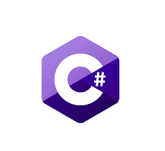

<h1 align="center"> 👋 Welcome To my Page 👋</h1>

<h2 align="center"> 🙋‍♂️ About Me 🙋‍♂️ </h2>


```yaml
Education:
  {
    "Diploma, Highschool",
    "Degree, Web Development",
  }

Hobbies:
  {
    "Web Development",
    "Application Development",
    "3D Printing",
    "Maintaining and Building computers"
    "Video Games"
  }
```

<h3 align="center"> 📚 My Knowledge Library 📚 </h3>

<p align="center">
    <!-- Programing languages -->
    
    
    
    
    
    
    
    <!-- Library's -->
    
    
    
    <!-- BDD -->
    
    
    
    <!-- Tools-->
    
    
    
    
                
</p>
